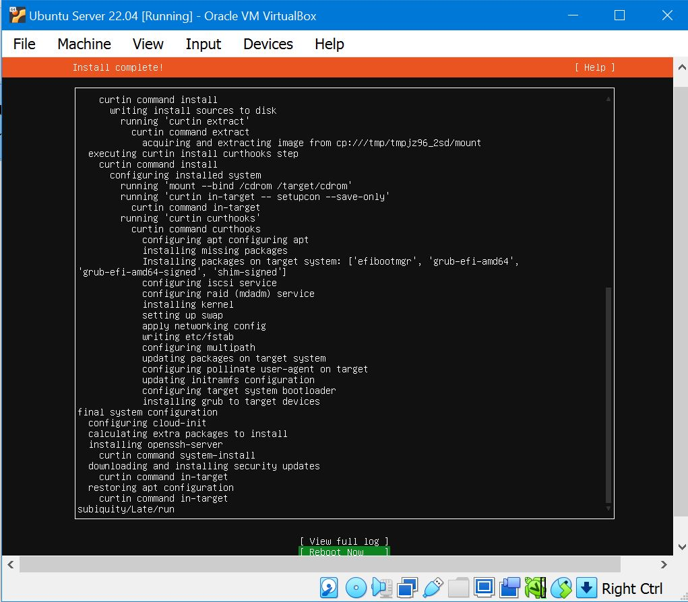

# Tutorial: Installing Ubuntu Server in VirtualBox

In this tutorial, we will walk you through the process of installing Ubuntu Server in VirtualBox, a popular virtualization software.

## Prerequisites

Before you begin, make sure you have the following:

- VirtualBox installed on your computer. You can download it from the [VirtualBox website](https://www.virtualbox.org/).
- Ubuntu Server ISO image. You can download the latest version from the [Ubuntu Server download page](https://ubuntu.com/download/server).

## Step 1: Create a New Virtual Machine

1. Open VirtualBox and click the "New" button.
2. Choose a name for your virtual machine (e.g., "Ubuntu Server").
3.  Select "Linux" as the type and "Ubuntu (64-bit)" as the version.

## Step 2: Configure Virtual Machine Settings

1. Set the memory size for your virtual machine. We recommend at least 1 GB for Ubuntu Server.
2. Choose "Create a virtual hard disk now" and click "Create."

## Step 3: Create a Virtual Hard Disk

1. Choose "VDI (VirtualBox Disk Image)" as the hard disk file type.
2. Select "Dynamically allocated" for storage on physical hard disk.
3. Set the virtual hard disk size. We recommend at least 10 GB.

4. Now View all your Configurations. Click Finish.

## Step 4: Install Ubuntu Server

1. Right-click on the virtual machine you created and select "Settings."
2. Go to the "Storage" section, click on the empty optical drive, and choose the Ubuntu Server ISO image you downloaded.
3. Or Simply Start the virtual machine and then select the ISO image you Downloaded.

## Step 5: Install Ubuntu Server

1. Select "Install Ubuntu Server" from the boot menu or wait it will start automatically.

2. Choose your language and press Enter.

3. Now in Installer update available. Choose Continue without updating.

4. Select your  keyboard layout, and other settings.

5. Select the Default Ubuntu Server install and press Enter

6. Now it Will automatically set your Network Connection. Choose Done.

7. Now setup the proxy setting Just leave it blank and press Enter.

8. Next Select the default Mirror address

9. Now Select the option to use an entire disk. Use the spacebar to select thi soption,(X) means it is selected . Use tab to move down and hit Enter.

10. Erase disk and install Ubuntu server. Press Done and choose Contine in confirm destructive actions.

11. Create a user account and password.

12. Choose the default skip option in Upgrade to Ubuntu pro and click Continue.

13. If you want to access the server remotely using the SSH then you can select the Install OpenSSH Server option using arrow keys and spacebar otherwise simply select the DONE.

14. If you wanyt to install some popular and common server software packages such as Docker? Then you can select them here otherwise, leave them unselected and select the Done option.

15. Wait for the installation to complete and hit Reboot Now.

## Step 6: Complete the Installation

1. After the installation is complete, the VM will prompt you to remove the installation media (ISO).
2. Press Enter to reboot the virtual machine.

## Step 7: Access Ubuntu Server

1. Once the virtual machine restarts, you will see the login prompt.
2. Enter the username and password you created during installation.

Congratulations! You have successfully installed Ubuntu Server in VirtualBox.

## Step 8: Port Forwarding in VirtualBox

1. Right-click on the installed virtual machine and choose "Settings" from the context menu.
2. In the Settings window, go to the "Network" section.
3. Here, you'll see a tab named "Port Forwarding" within the Network settings. Click on it.
4. Click the "+" icon to add a new port forwarding rule. A new row will be added to the port forwarding table.
5. In this table, you'll need to specify the following information for the port forwarding rule:

6. After filling in the necessary information, click "OK" to save the port forwarding rule.

## Step 8: Acess your Ubuntu server via Bitvise SSH Client

1. Go to the official Bitvise website and download the [Bitvise SSH Client](https://www.bitvise.com/ssh-client-download) installer suitable for your operating system.
2. Once the installation is complete, launch the Bitvise SSH Client from the Start Menu or desktop shortcut, depending on where it was installed.
3. When you launch Bitvise SSH Client, you'll be presented with the main interface. To set up an SSH connection, follow these steps:
     - Profile Name: Give your profile a meaningful name.
     - Host: Enter the IP address of your Ubuntu server.
     - Port: Use the default SSH port, which is usually 22.
     - Username: Enter your Ubuntu server username.
     - Using Password authentication, enter your Ubuntu server password.
4. Click the "Save Profile" button to save your SSH profile.

5. Select the profile you just created and click the "Login" button to initiate the SSH connection.
6. If you're connecting to the server for the first time, you'll be prompted to accept the server's host key. This is a security measure to ensure you're connecting to the right server.
7. Once the connection is established, you'll have access to your Ubuntu server's terminal through the Bitvise SSH Client's terminal window.

   
## Conclusion

In this tutorial, you learned how to create a virtual machine and install Ubuntu Server using VirtualBox. Also You've learned how to access your Ubuntu server using the Bitvise SSH Client. This setup is useful for testing, learning, and development purposes.
