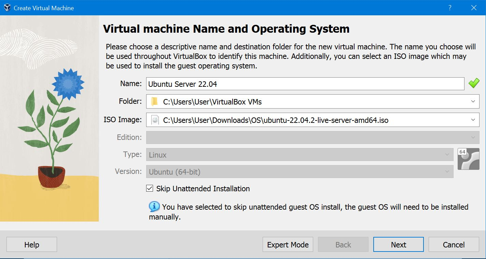

# Tutorial: Installing Ubuntu Server in VirtualBox

In this tutorial, we will walk you through the process of installing Ubuntu Server in VirtualBox, a popular virtualization software.

## Prerequisites

Before you begin, make sure you have the following:

- VirtualBox installed on your computer. You can download it from the [VirtualBox website](https://www.virtualbox.org/).
- Ubuntu Server ISO image. You can download the latest version from the [Ubuntu Server download page](https://ubuntu.com/download/server).

## Step 1: Create a New Virtual Machine

1. Open VirtualBox and click the "New" button.
2. Choose a name for your virtual machine (e.g., "Ubuntu Server").
3.  Select "Linux" as the type and "Ubuntu (64-bit)" as the version.

## Step 2: Configure Virtual Machine Settings

1. Set the memory size for your virtual machine. We recommend at least 1 GB for Ubuntu Server.
2. Choose "Create a virtual hard disk now" and click "Create."

## Step 3: Create a Virtual Hard Disk

1. Choose "VDI (VirtualBox Disk Image)" as the hard disk file type.
2. Select "Dynamically allocated" for storage on physical hard disk.
3. Set the virtual hard disk size. We recommend at least 10 GB.

## Step 4: Install Ubuntu Server

1. Right-click on the virtual machine you created and select "Settings."
2. Go to the "Storage" section, click on the empty optical drive, and choose the Ubuntu Server ISO image you downloaded.
3. Or Simply Start the virtual machine and then select the ISO image you Downloaded.

## Step 5: Install Ubuntu Server

1. Select "Install Ubuntu Server" from the boot menu.
2. Choose your language and press Enter.
3. Select your location, keyboard layout, and other settings.
4. Enter a hostname for your server.
5. Create a user account and password.
6. Choose to encrypt your home directory (optional but recommended).
7. Configure the clock and time zone settings.
8. Partition the disk. You can choose to use the entire disk or set up custom partitions.
9. Select software to install. Choose the OpenSSH server for remote access.
10. Wait for the installation to complete.

## Step 6: Complete the Installation

1. Once the installation is done, remove the installation media (ISO image) from the virtual optical drive.
2. Select "Continue" to reboot the virtual machine.

## Step 7: Access Ubuntu Server

1. Once the virtual machine restarts, you will see the login prompt.
2. Enter the username and password you created during installation.

Congratulations! You have successfully installed Ubuntu Server in VirtualBox.

## Conclusion

In this tutorial, you learned how to create a virtual machine and install Ubuntu Server using VirtualBox. This setup is useful for testing, learning, and development purposes.
